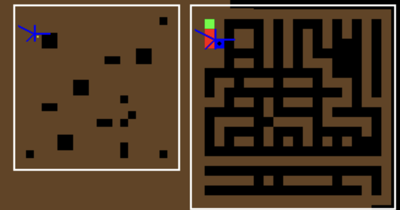
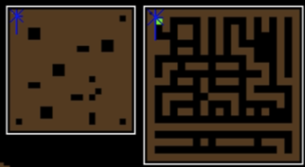
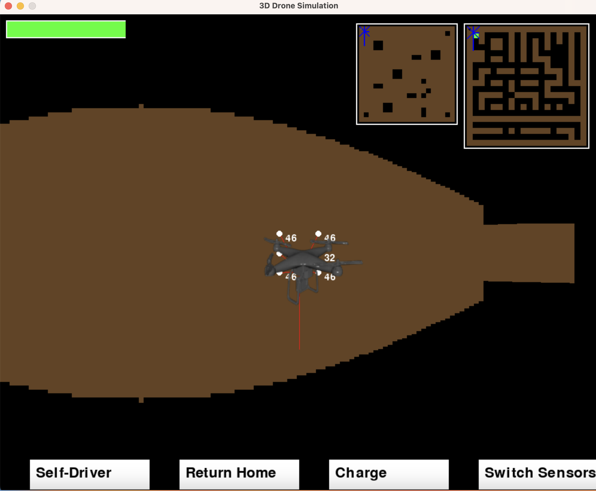
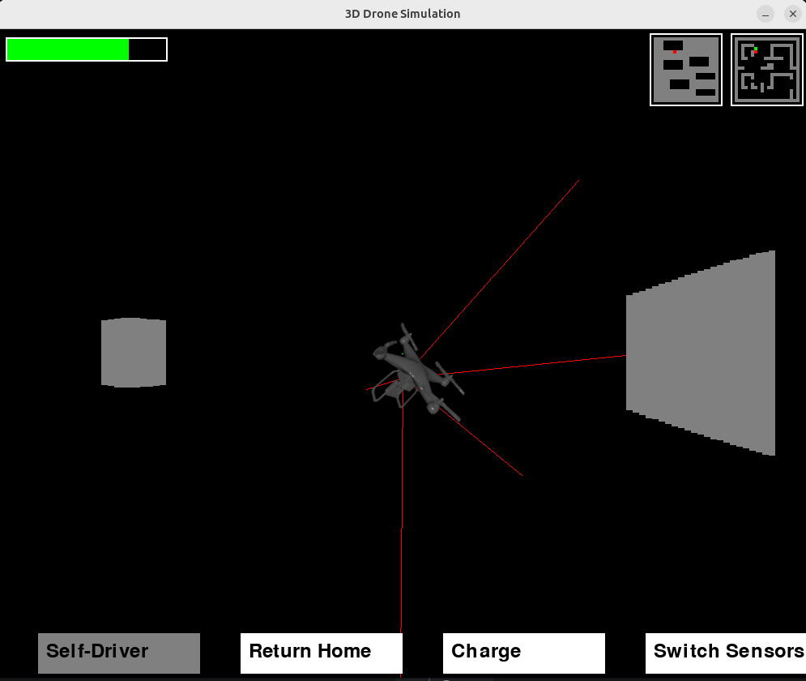

# 3D Drone Simulation


## Overview
This project is an extension of a previous [2D drone simulation project](https://github.com/roni5604/Model_2D_drone_simulator) and aims to simulate a 3D drone environment using Pygame. The initial 2D project involved creating a basic control system for drone navigation, sensor modeling, and platform search in a 2D space. The 2D drone was able to move in a plane, detect obstacles with simple sensor models, and navigate through predefined maps.


The transition from 2D to 3D brought several challenges and improvements:
1. **Dimension Expansion**: Moving from a flat plane to a 3D space added complexity in terms of movement, sensor detection, and obstacle management.
2. **Sensor Modeling**: Adapting the sensor models to a 3D environment required enhancements to cover vertical as well as horizontal obstacle detection.
3. **Autonomous Navigation**: Developing AI algorithms capable of handling 3D navigation and obstacle avoidance.
4. **Visualization**: Enhancing the graphical representation to depict a more realistic 3D environment.


The 3D project now includes drone movement, sensor visualization, autonomous navigation, and return home functionality. The drone can navigate through a predefined map with obstacles, and the user can switch between different sensor configurations.


This project builds upon the foundations laid by the [base project in Java](https://github.com/vection/DroneSimulator) that we started from.


## Project Structure


### `main.py`
This is the entry point of the application. It initializes and starts the game, setting up the necessary environment for the simulation to run.


### `game.py`
Contains the `Game` class, which is responsible for the main game loop, handling events, and updating the game state. This class orchestrates the interaction between the drone, sensors, map, and user inputs.


**Functions:**
- `__init__(self)`: Initializes the game, including setting up the screen, clock, and game objects such as the drone and map.
- `cast_rays(self)`: Casts rays for the field of view visualization, simulating the drone's sensors.
- `calculate_risky(self)`: Calculates the risk of obstacles in the drone's path based on sensor data, determining potential collisions.
- `calculate_risky_up_down(self)`: Calculates the risk of obstacles above and below the drone, ensuring comprehensive obstacle detection in the 3D space.
- `autonomous_movement(self)`: Handles the drone's autonomous movement using AI algorithms to navigate through the environment.
- `return_home_movement(self)`: Handles the drone's return home movement, ensuring it can safely return to its starting point.
- `run(self)`: Main game loop, handling events, updating the game state, and rendering the screen.


### `drone.py`
Contains the `Drone` class, which models the drone's properties and behaviors. It encapsulates all the functionality related to the drone's movement and interactions with the environment.


**Functions:**
- `__init__(self)`: Initializes the drone with its attributes such as position, speed, and images, setting up the initial state.
- `format_rotation(self, rotation_value)`: Formats the rotation value to keep it within 0-360 degrees, ensuring proper angle calculations.
- `rotate_image(self, angle)`: Rotates the drone image to match the current angle, providing visual feedback for the drone's orientation.
- `draw(self, screen)`: Draws the drone on the screen, updating its position and rotation.


### `sensor.py`
Contains the `Sensor` class, which models the drone's sensors. These sensors are crucial for obstacle detection and navigation.


**Functions:**
- `__init__(self, drone)`: Initializes the sensors with the drone reference and configurations, setting up their positions and detection ranges.
- `draw(self, screen)`: Draws the sensor rays on the screen, visualizing the sensor data and detected obstacles.


### `map.py`
Contains the `Map` class, which defines the map properties such as width, height, and scale. It also manages the placement of obstacles and the overall layout.


**Functions:**
- `__init__(self)`: Initializes the map dimensions and scale, setting up the environment for the simulation.


### `button.py`
Contains the `Button` class, which models the interactive buttons in the UI. These buttons allow the user to interact with the simulation, enabling or disabling features.


**Functions:**
- `__init__(self, text, x, y, width, height)`: Initializes the button with its properties, setting up its position and appearance.
- `draw(self, screen)`: Draws the button on the screen, providing visual feedback for user interactions.


### `world_params.py`
Contains constant variables used throughout the project, including screen dimensions and map data. These constants ensure consistency and easy adjustments to the simulation settings.


**Constants:**
- `SCREEN_WIDTH`: Width of the game window, determining the horizontal size of the simulation.
- `SCREEN_HEIGHT`: Height of the game window, determining the vertical size of the simulation.
- `APARTMENT1_FLOOR`: 2D array representing the floor layout of the first apartment, defining the navigable area.
- `APARTMENT1_WALLS`: 2D array representing the wall layout of the first apartment, defining obstacles.
- `APARTMENT2_FLOOR`: 2D array representing the floor layout of the second apartment, providing a different environment for testing.
- `APARTMENT2_WALLS`: 2D array representing the wall layout of the second apartment, adding variety to the obstacle configurations.
- `CEILING2_MAP`: 2D array representing the ceiling layout of the second apartment, ensuring a complete 3D environment.


## Main Missions/Features


### Return Home
**Functionality:**
The return home function is designed to guide the drone back to its starting position automatically. This is crucial for ensuring that the drone can return safely after completing its mission or when it encounters a problem.


**Purpose:**
The purpose of the return home feature is to provide a failsafe mechanism for the drone, ensuring it can always return to a known location. This is especially important in real-world applications where drones may need to return to a charging station or avoid hazardous situations.


**Usage:**
The return home function can be activated via the "Return Home" button in the UI. When activated, the drone stops its current task and begins navigating back to its starting point.


**Implementation:**
The return home functionality is implemented using the `return_home_movement` method in the `Game` class. This method calculates the safest and most efficient path back to the starting position, avoiding obstacles along the way.


**Challenges and Solutions:**
- **Pathfinding:** Ensuring the drone finds the safest path back home was challenging. We implemented advanced pathfinding algorithms to calculate the optimal route.
- **Obstacle Avoidance:** Avoiding obstacles while returning home required integrating the obstacle detection sensors into the return home logic. We refined our sensor data processing to ensure the drone could navigate safely.
- **Testing:** Extensive testing was required to ensure the return home function worked reliably in various scenarios, including different map layouts and obstacle configurations.


### Sensors
**Functionality:**
Sensors are critical components of the drone, enabling it to detect obstacles and navigate safely. In this project, sensors simulate the detection of objects in the drone's environment and visualize this information for the user.


**Purpose:**
The sensors' primary purpose is to provide the drone with the necessary data to avoid collisions and navigate autonomously. They allow the drone to "see" its surroundings and make informed decisions.


**Usage:**
- **Obstacle Detection:** Sensors detect obstacles within their range and provide feedback to the drone's navigation system.
- **Visualization:** The detected obstacles are visualized on the screen using rays, helping users understand the drone's perception.


** Adding Sensors to the Drone**


The `Sensor` class is responsible for modeling the drone's sensors, which detect obstacles around the drone. Each sensor configuration represents a different set of angles at which the sensors operate, allowing the drone to "see" obstacles at various degrees around it.


** Sensor Class**
The `Sensor` class is initialized with a reference to the `Drone` object. This allows the sensors to access the drone's current state, such as its position and orientation.


```python
class Sensor:
   def __init__(self, drone):
       self.drone = drone
       self.configs = [
           [-90, -45, 0, 45, 90],
           [-90, -70, -45, 0, 45, 70, 90],
           [-135, -90, -70, -45, 0, 45, 70, 90, 135],
       ]
```


In this class:
- `self.drone` stores a reference to the drone object.
- `self.configs` contains a list of sensor configurations. Each configuration is a list of angles (in degrees) at which the sensors will detect obstacles.


** Sensor Configurations **


Initially, the `Sensor` class has the following configurations:


```python
self.configs = [
   [-90, -45, 0, 45, 90],
   [-90, -70, -45, 0, 45, 70, 90],
]
```


Each list within `self.configs` represents a different configuration of sensors:
- `[-90, -45, 0, 45, 90]` represents sensors placed at -90°, -45°, 0°, 45°, and 90° relative to the drone's forward direction.
- `[-90, -70, -45, 0, 45, 70, 90]` adds additional sensors at -70° and 70°, providing more coverage.


To enhance the drone's sensing capabilities, we added a new configuration:


```python
self.configs = [
   [-90, -45, 0, 45, 90],
   [-90, -70, -45, 0, 45, 70, 90],
   [-135, -90, -70, -45, 0, 45, 70, 90, 135],
]
```


The new configuration `[-135, -90, -70, -45, 0, 45, 70, 90, 135]` includes sensors at -135°, 135°, and other angles, providing even greater coverage around the drone. This allows the drone to detect obstacles from a wider range of angles.


**Sensor Behavior:**
Different sensors can be configured to have various detection angles and ranges. For example:
- **Front Sensors:** Typically have a narrow and long range, detecting obstacles directly in front of the drone.
- **Side Sensors:** Have a wider but shorter range, detecting obstacles to the sides.
- **Up/Down Sensors:** Detect obstacles above and below the drone, ensuring comprehensive 3D obstacle detection.


### Map
**Functionality:**
The map defines the environment in which the drone operates. It includes various elements such as floors, walls, and obstacles, providing a realistic simulation space.


**Purpose:**
The map serves as the testing ground for the drone's navigation and obstacle avoidance capabilities. It allows users to create different scenarios and test the drone's performance.


**Appearance:**
- **Floors:** Represented by different colors to distinguish between levels.
- **Walls:** Marked with distinct boundaries to indicate obstacles.


**Navigation:**
The drone navigates the map using a combination of manual control and autonomous algorithms. Users can switch between floors and observe how the drone interacts with different obstacles.


**Floor Navigation:**
- **Switching Floors:** The map supports multiple floors, and users can switch between them to test the drone's navigation in different environments.
- **Color Coding:** Each floor is color-coded to provide a clear visual distinction, making it easier to understand the drone's position.


**Observation:**
Users can observe the drone's movement, sensor detection, and obstacle avoidance in real-time. The visualization includes sensor rays, the drone's path, and detected obstacles, providing comprehensive feedback on the drone's performance.


### Screenshots


#### Initial Position


This screenshot shows the initial position of the drone in the simulation. The drone starts at a predefined point, ready for manual or autonomous navigation.


#### On the Way - Where Am I?



In this screenshot, the drone is navigating through the environment. The sensor rays are actively detecting obstacles, and the drone is making real-time decisions to avoid collisions.


#### Initial Start - Where Am I?



This image depicts the drone at the start of a new mission. The map and sensors are initialized, and the drone is ready to begin its journey.


#### Floor 1



This screenshot shows the layout of the first floor in the simulation environment. It includes obstacles and navigable areas that the drone must navigate through.


#### Floor 2



This image displays the second floor of the simulation environment, providing a different set of challenges and obstacles for the drone to navigate.


### Self Navigation


The self-navigation feature of the drone allows it to autonomously move through the environment, avoiding obstacles and making decisions based on sensor inputs. This section provides a deep dive into how the autonomous movement (`autonomous_movement`) works, including its behavior, decision-making process, and obstacle avoidance strategies.


#### Overview


The `autonomous_movement` function is responsible for controlling the drone's movements without user input. It uses sensor data to detect obstacles and navigate through the map. The drone continuously assesses its surroundings and adjusts its course to avoid collisions.


#### Behavior


The autonomous movement follows these general steps:


1. **Sensor Data Collection**: The drone's sensors collect data about the environment, detecting obstacles at various angles.
2. **Risk Assessment**: The function evaluates the sensor data to identify potential obstacles and calculate the risk of collision.
3. **Decision Making**: Based on the risk assessment, the drone makes decisions on how to adjust its path to avoid obstacles.
4. **Movement Adjustment**: The drone changes its speed and direction according to the decisions made, ensuring a safe path is followed.


#### Sensor Data Collection


The drone is equipped with sensors that detect obstacles at various angles around it. The sensor configurations define the angles at which the sensors operate. Each configuration provides a different level of coverage, allowing the drone to see obstacles from multiple directions.


#### Risk Assessment


The function `calculate_risky` evaluates the sensor data to determine the risk of obstacles in the drone's path. Here's how it works:


1. **Sensor Angles**: The drone checks the predefined sensor angles for obstacles.
2. **Depth Calculation**: For each angle, the function calculates the depth (distance) to the nearest obstacle.
3. **Risk Identification**: If an obstacle is detected within a dangerous distance, it is marked as a risky area.


The drone also evaluates obstacles above and below it using `calculate_risky_up_down`, which ensures it can avoid obstacles in three dimensions.


#### Decision Making


The drone makes decisions based on the risk assessment:


1. **Obstacle Detection**: If obstacles are detected within a dangerous distance, the drone stops moving forward to avoid collision.
2. **Direction Adjustment**: The drone adjusts its direction based on the location of the detected obstacles:
  - If the nearest obstacle is to the left, the drone rotates slightly to the right.
  - If the nearest obstacle is to the right, the drone rotates slightly to the left.
3. **Movement Resumption**: Once a safe path is identified, the drone resumes forward movement.


The drone continuously adjusts its direction to avoid obstacles while maintaining a smooth and efficient path.


#### Movement Adjustment


The drone's movement is adjusted based on the decisions made:


1. **Speed Control**: The drone's speed is set to zero when an obstacle is detected within a dangerous distance. It resumes its normal speed once a safe path is identified.
2. **Direction Control**: The drone's direction (gyro angle) is adjusted slightly to the left or right to navigate around obstacles.


Additionally, the drone can move between different layers (floors) in the environment. When it detects a transition point (e.g., a hole in the floor), it adjusts its altitude to move to the next layer.


### Summary


The self-navigation feature of the drone relies on continuous sensor data collection, risk assessment, decision making, and movement adjustment. By evaluating the environment and making real-time decisions, the drone can autonomously navigate through the map, avoiding obstacles and maintaining a safe and efficient path. This modular approach ensures that the drone can adapt to various environments and challenges, providing robust autonomous navigation capabilities.


## How to Run the Project
1. Make sure you have Python and Pygame installed on


your system. You can install Pygame using pip:
  ```sh
  pip install pygame
  ```
2. Place all the files in a directory.
3. Run the `main.py` file:
  ```sh
  python main.py
  ```


## Usage
- **AI Button**: Enables autonomous movement of the drone, allowing it to navigate the environment using built-in AI algorithms.
- **Return Home Button**: Initiates the return home sequence for the drone, guiding it back to its starting position.
- **Switch Sensors Button**: Switches between different sensor configurations, allowing the user to test various setups and their effectiveness.


## Project Features
- **Drone Movement**: The drone can be controlled using the keyboard for manual movement. It can move forward, rotate, and switch between autonomous and manual control modes.
- **Sensor Visualization**: The sensors detect obstacles and visualize the detected obstacles using lines on the screen, providing real-time feedback on the drone's surroundings.
- **Autonomous Navigation**: The drone can autonomously navigate through the map, avoiding obstacles and reaching its destination.
- **Return Home Functionality**: The drone can return to its starting position automatically, ensuring a safe and efficient return.

## Final Design Additions We Made

- **User Interface Enhancements**: Improve the UI to make it more intuitive and user-friendly, allowing users to interact with the simulation more effectively, For example, add dots on the walls with the distances from the drone sensors.
- **Movement outputs**: Add a text (in terminal) output that shows the drone's movement in real-time, providing additional feedback to the user.

## Future Improvements
- **3D Visualization**: Enhance the visualization to represent a more realistic 3D environment, improving the user experience.
- **Improved AI**: Implement more sophisticated AI algorithms for better autonomous navigation, enhancing the drone's decision-making capabilities.
- **Additional Maps**: Add more maps and allow dynamic loading of different environments, providing more testing scenarios and increasing the project's versatility.


## Contributing
Feel free to fork this repository, make improvements, and submit pull requests. Contributions are always welcome!


## License
This project is licensed under the MIT License. See the [LICENSE](LICENSE) file for details.


## Authors
- [Naor Ladani](https://github.com/Naorl98)

